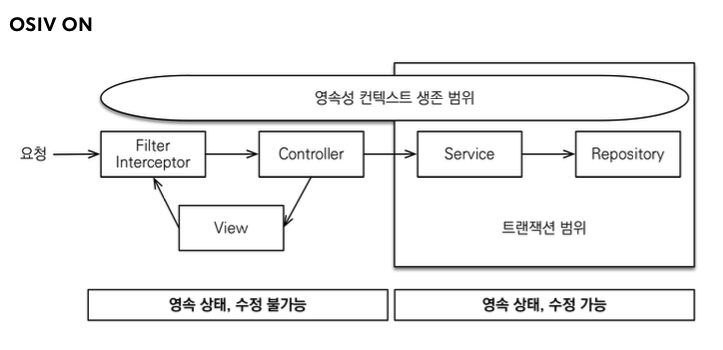
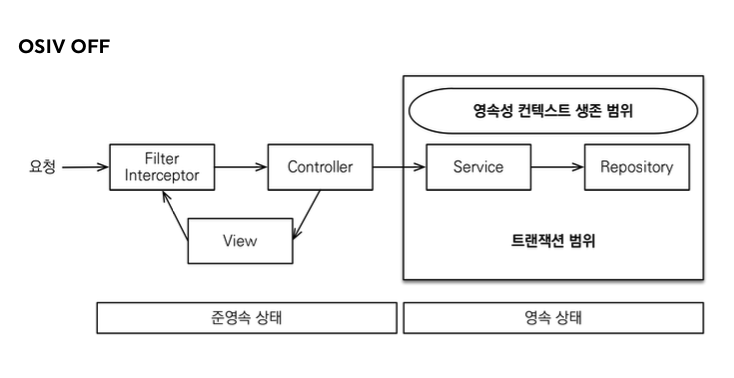

# 1. JPA 활용 1편 정리

## 1. 엔티티 설계시 주의점
   1. 엔티티에는 가급적 Setter를 사용하지 말자
      1. Setter가 모두 열려있으면 변경 포인트가 많아서 유지보수가 어려움
   2. 모든 연관관계는 지연로딩으로 설정하자
      1. 즉시로딩은 예측이 어렵고, 어떤 SQL이 실행될지 추적하기 어려움. JPQL에서는 N+1 문제가 자주 발생함
      2. 연관된 엔티티를 함께 DB에서 조회해야 하면 fetch join 또는 엔티티 그래프 기능을 사용하자
      3. XToOne 관계는 기본이 즉시로딩이므로 직접 지연로딩으로 설정해주자
   3. 컬렉션은 필드에서 초기화하자
      1. 컬렉션은 필드에서 바로 초기화하는 것이 안전하다. 
      2. null 문제에서 안전하다.
      3. 하이버네이트는 엔티티를 영속화 할 때, 컬렉션을 감싸서 하이버네이트가 제공하는 내장 컬렉션으로 변경한다. 만약 getOrders() 처럼 임의의 메서드에서 컬렉션을 잘못 생성하면 하이버네이트 내부 메커니즘에 문제가 발생할 수 있다. 따라서 필드레벨에서 생성하는 것이 안전하고 코드도 간결하다.
      ~~~ java
      Member member = new Member();
      System.out.println(member.getOrders().getClass());
      em.persist(member); // 영속화
      System.out.println(member.getOrders().getClass());
      
      //출력 결과
      class java.util.ArrayList
      class org.hibernate.collection.internal.PersistentBag
      ~~~
   4. 테이블, 컬럼명 생성 전략
      - 스프링 부트에서 하이버네이트 기본 매핑 전략을 변경해서 실제 테이블 필드명은 다름
        - https://docs.spring.io/spring-boot/docs/2.1.3.RELEASE/reference/htmlsingle/#howto-configure-hibernate-naming-strategy
        -  http://docs.jboss.org/hibernate/orm/5.4/userguide/html_single/Hibernate_User_Guide.html#naming
      - 하이버네이트 기존 구현 : 엔티티의 필드명을 그대로 테이블의 컬럼명으로 사용 (`SpringPhysicalNamingStrategy`)
      - 스프링 부트 신규 설정 (엔티티(필드) -> 테이블(컬럼))
        - 카멜 케이스 -> (_)언더스코어 ex) memberPoint -> member_point
        - . -> 언더스코어
        - 대문자 -> 소문자
      - **적용 2 단계**
        1. 논리명 생성: 명시적으로 컬럼, 테이블명을 직접 적지 않으면 ImplicitNamingStrategy 사용
           `spring.jpa.hibernate.naming.implicit-strategy` : 테이블이나, 컬럼명을 명시하지 않을 때 논리명 적용
        2. 물리명 적용: `spring.jpa.hibernate.naming.physical-strategy` : 모든 논리명에 적용됨, 실제 테이블에 적용
           (username usernm 등으로 회사 룰로 바꿀 수 있음)
        3. **스프링 부트 기본 설정**
           `spring.jpa.hibernate.naming.implicit-strategy:
           org.springframework.boot.orm.jpa.hibernate.SpringImplicitNamingStrategy`
           `spring.jpa.hibernate.naming.physical-strategy:
           org.springframework.boot.orm.jpa.hibernate.SpringPhysicalNamingStrategy` 

## 2. 연관관계 편의 메서드 위치
 - 연관관계 편의 메서드는 어디에 위치해도 상관없다. 연관관계 편의 메서드가 어디에 있든 결국 연관관계의 주인 쪽에 값이 설정되기 때문이다.

## 3. 스프링 부트의 테스트
 - 스프링 부트에서 테스트 모드에는 application.yml 등과 같이 설정을 안해줘도 자동으로 메모리 모드로 사용해준다. 
 - 스프링 부트 테스트에서는 ddl-auto: create-drop이 기본이다. 이것은 테스트를 다 돌리고 drop을 날려주는 것

## 4. CASCADE의 사용 범위는?
 - 라이프 사이클에서 동일하게 관련. 1개에 대해서만 참조를 할 떄 사용 가능 ex. 주문과 주문 상품
 - 만약 주문 상품을 다른 곳에서도 사용한다면 CASCADE를 사용하지 않는게 좋음

## 5. Entity는 순수하게 유지하자
 - 요구사항이 정말 단순할 때는 폼 객체(`MemberForm`) 없이 엔티티(`Member`)를 직접 등록과 수정 화면에서 사용해도 된다. 
 - 하지만 화면 요구사항이 복잡해지기 시작하면, 엔티티에 화면을 처리하기 위한 기능이 점점 증가한다. 
 - 결과적으로 엔티티는 점점 화면에 종속적으로 변하고, 이렇게 화면 기능 때문에 지저분해진 엔티티는 결국 유지보수하기 어려워진다.
 - 실무에서 **엔티티는 핵심 비즈니스 로직만 가지고 있고, 화면을 위한 로직은 없어야 한다**. 
 - 화면이나 API에 맞는 폼 객체나 DTO를 사용하자. 그래서 화면이나 API 요구사항을 이것들로 처리하고, 엔티티는 최대한 순수하게 유지하자

## 6. 변경 감지와 병합(merge)
- 준영속 엔티티란?
  - 영속성 컨텍스트가 더는 관리하지 않는 엔티티를 말한다.
  - DB를 갖다온 데이터(id 값이 있음)
  - 상품 수정으로 살펴보면 여기서는 `itemService.saveItem(book)` 에서 수정을 시도하는 `Book` 객체다. 
  `Book` 객체는 이미 DB에 한번 저장되어서 식별자가 존재한다. 
  이렇게 임의로 만들어낸 엔티티도 기존 식별자를 가지고 있으면 준영속 엔티티로 볼 수 있다.
- 준영속 엔티티를 수정하는 2가지 방법
  - 변경 감지 기능 사용
  - 병합(merge) 사용
### 변경 감지 기능 사용
    ~~~ java
    @Transactional
    void update(Item itemParam) { // itemParam: 파리미터로 넘어온 준영속 상태의 엔티티
       Item findItem = em.find(Item.class, itemParam.getId()); // 같은 엔티티를 조회한다.(영속 상태)
        findItem.setPrice(itemParam.getPrice()); // 데이터를 수정한다.
    }
    ~~~
 - 영속성 컨텍스트에서 엔티티를 다시 조회한 후에 데이터를 수정하는 방법
 - 트랜잭션 안에서 엔티티를 다시 조회, 변경할 값 선택 -> 트랜잭션 커밋 시점에 변경 감지(Dirty Checking)이 동작해서 데이터베이스에서 UPDATE SQL 실행
### 병합 사용
  - 병합은 준영속 상태의 엔티티를 영속 상태로 변경할 때 사용하는 기능이다.
  ~~~ java
    @Transactional
    void update(Item itemParam) { //itemParam: 파리미터로 넘어온 준영속 상태의 엔티티
        Item mergeItem = em.merge(itemParam);
    }
  ~~~
  
  - 병합 동작 방식
    - merge()를 실행
    - 파라미터로 넘어온 준영속 엔티티의 식별자 값으로 1차 캐시에서 엔티티를 조회
    - 만약 1차 캐시에 엔티티가 없으면 데이터베이스에서 엔티티를 조회하고, 1차 캐시에 저장
    - 조회한 영속 엔티티(mergeMember)에 member 엔티티의 값을 채워 넣는다. (member 엔티티의 모든 값을 mergeMember에 밀어 넣는다. 이때 mergeMember의 '회원1'이라는 이름이 '회원명변경'으로 바뀐다.)
    - 영속 상태인 mergeMember를 반환한다
  - 병합시 동작 방식을 간단하게 정리하기!!
    - 준영속 엔티티의 식별자 값으로 영속 엔티티를 조회
    - 영속 엔티티의 값을 준영속 엔티티의 값으로 모두 교체(병합)
    - 트랜잭션 커밋 시점에 변경 감지 기능이 동작해서 데이터베이스에 UPDATE SQL 실행
- !!!주의!!! 변경 감지 기능을 사용하면 원하는 속성만 선택해서 변경할 수 있지만, 병합을 사용하면 모든 속성이 변경된다. 병합시 값이 없으면 null로 업데이트할 위험도 있다.

-----
# 2. JPA 활용 2편

## 1. API를 만들어서 사용할 때는 엔티티를 넘기거나 받지말자
- 문제점 
  - 엔티티에 프레젠테이션 계층을 위한 로직이 추가된다. 
  - 엔티티에 API 검증을 위한 로직이 들어간다. (@NotEmpty 등등)
  - 실무에서는 회원 엔티티를 위한 API가 다양하게 만들어지는데, 한 엔티티에 각각의 API를 위한 모든 요청 요구사항을 담기는 어렵다. 
  - 엔티티가 변경되면 API 스펙이 변한다. 
- 결론 
  - API 요청 스펙에 맞추어 별도의 DTO를 파라미터로 받는다.

## 2. API 개발 고급 - 지연 로딩과 조회 성능 최적화
 ### 1. 엔티티를 직접 노출(V1)
   - 엔티티를 직접 노출할 때는 양방향 연관관계가 걸린 곳은 꼭 한 곳에 @JsonIgnore 처리를 해야 한다. 해주지 않으면 양쪽 서로를 호출하면서 무한 루프 발생
   - 해결 방법은 Hibernate5Module을 사용하면 되는데 이 방법보다는 DTO로 변환해서 반환하는 것이 더 좋은 방법이다.
   - LAZY를 피하기 위해 EAGER로 설정하면 안된다. 즉시 로딩 때문에 연관관계가 필요 없는 경우에도 데이터를 항상 조회해서 성능 문제가 발생할 수 있다.
 ### 2. 엔티티를 DTO로 변환(V2)
   - 쿼리가 총 1 + N + N번 실행 된다(v1과 쿼리수 결과는 같음)
   - order 조회 1번(order 조회 결과 수가 N이 된다)
   - order -> member 지연 로딩 조회 N번
   - order -> delivery 지연 로딩 조회 N번
   - v2의 결과는 order의 개수가 2개이므로 1 + 2(회원) + 2(배송지) 실행
   - 만약 1명의 유저가 2개의 주문을 했다면 영속성 컨텍스트에 있는 걸로 조회하기 때문에 쿼리를 날리지 않음
 ### 3. 엔티티를 DTO로 변환, 페치 조인으로 최적화(V3)
   - 엔티티를 페치 조인(fetch join)을 사용해서 쿼리 1번에 조회
   - 페치 조인으로 `order -> member` , `order -> delivery` 는 이미 조회 된 상태 이므로 지연로딩X
 ### 4. JPA에서 DTO로 바로 조회(V4)
   - 일반적인 SQL을 사용할 때 처럼 원하는 값을 선택해서 조회
   - new 명령어를 사용해서 JPQL의 결과를 DTO로 즉시 변환
   - SELECT 절에서 원하는 데이터를 직접 선택하므로 DB에서 애플리케이션 네트워크 용량 최적화(생각보다 미비함)
   - 리포지토리 재사용성이 떨어진다. API 스펙에 맞춘 코드가 리포지토리에 들어가는 단점이 있음
 
 ### 정리
   - 엔티티를 DTO로 변환하거나, DTO로 바로 조회하는 두가지 방법은 각각 장단점이 있다. 둘중 상황에 따라서 더 나은 방법을 선택하면 된다.
   - 엔티티로 조회하면 리포지토리 재사용성도 좋고, 개발도 단순해진다.
   - 쿼리 방식 선택 권장 순서
     - 우선 엔티티를 DTO로 변환하는 방법을 선택한다(V2).
     - 필요하면 페치 조인으로 성능 최적화를 한다(V3).
     - 그래도 안되면 DTO로 직접 조회하는 방법을 사용한다(V4).
     - 최후의 방법은 JPA가 제공하는 네이티브 SQL이나 Spring JDBC Template를 사용해서 SQL 직접 사용한다.

## 2. API 개발 고급 - 컬렉션 조회 최적화
 ### 1. 엔티티를 직접 노출(V1)
  - 지연 로딩과 조회 성능 최적화할 때 사용한 방식과 같다.
 ### 2. 엔티티를 DTO로 변환(V2)
  - V2 엔티티를 DTO 반환할 때 엔티티를 외부에 노출하지 않기 위해서 DTO를 만들 때 안에 있는 컬렉션도 엔티티가 아니라 DTO로 만들어서 노출시켜야 한다. 
  - 완전히 엔티티와 의존성을 끊어내야한다.
 ### 3. 엔티티를 DTO로 변환, 페치 조인 최적화(V3)
  - 페치 조인으로 SQL이 1번만 실행됨
  - distinct를 사용한 이유는 1대다 조인이 있으므로 DB row가 증가하기 때문에 그 결과 같은 order 엔티티의 조회 수도 증가하게 된다.
  - JPA의 distinct는 SQL에 distinct를 추가하고, 더해서 같은 엔티티가 조회되면, 애플리케이션에서 중복을 걸러준다.
  - 컬렉션 페치 조인을 사용하면 페이징이 불가능하다.
  - 컬렉션 페치 조인은 1개만 사용할 수 있다. 둘 이상 페치 조인을 사용하면 부정합하게 조회될 수 있다.
  - 하이버네이트 6 버전 부터는 자동으로 distinct가 적용이 된다.
 ### 3.1. 엔티티를 DTO로 변환, 페이징과 한계 돌파(V3.1)
  ### 페이징과 한계 돌파
   - 컬렉션을 페치 조인하면 페이징이 불가능하다.
     - 컬렉션을 페치 조인하면 일대다 조인이 발생하므로 데이터가 예측할 수 없이 증가한다.
     - 일대다에서 1을 기준으로 페이징을 하는 것이 목적이다. 그런데 데이터는 N을 기준으로 row가 생성된다.
     - ex) Order를 기준으로 페이징 하고 싶은데, N인 OrderItem을 조인하면 OrderItem이 기준이 되어버린다.
   - 이 경우 하이버네이트는 경고 로그를 남기고 모든 DB 데이터를 읽어서 메모리에서 페이징을 시도한다. 최악의 경우 장애로 이어질 수 있다.
  #### 한계 돌파
   - 페이징 + 컬렉션 엔티티 조회 문제는 아래 방법으로 해결할 수 있다.
     - 먼저 ToOne(OneToOne, ManyToOne) 관계를 모두 페치조인 한다. ToOne 관계는 row수를 증가시키지 않으므로 페이징 쿼리에 영향을 주지 않는다.
     - 컬렉션은 지연 로딩으로 조회한다.
     - 지연 로딩 성능 최적화를 위해 `hibernate.default_batch_fetch_size` , `@BatchSize`를 적용한다.
       - hibernate.default_batch_fetch_size : 글로벌 설정
       - @BatchSize: 개별 최적회(ToMany는 컬럼 위에, ToOne은 엔티티 위에 설정)
       - 이 옵션을 사용하면 컬렉션이나, 프록시 객체를 한꺼번에 설정한 size 만큼 IN 쿼리로 조회한다.
     - 최적화 옵션
     ~~~ yml
        # 개별로 설정하려면 `@BatchSize` 를 적용하면 된다. (컬렉션은 컬렉션 필드에, 엔티티는 엔티티 클래스에 적용)
        spring:
        jpa:
        properties:
        hibernate:
        default_batch_fetch_size: 1000
     ~~~
     - 장점
       - 쿼리 호출 수가 1 + N -> 1 + 1 으로 최적화 된다.
       - 조인보다 DB 데이터 전송량이 최적화 된다.
       - 페치 조인 방식과 비교해서 쿼리 호출 수가 약간 증가하지만, DB 데이터 전송량이 감소한다.
       - 컬렉션 페치 조인은 페이징이 불가능하지만 해당 방법은 페이징이 가능하다.
     - 결론
       - ToOne 관계는 페치 조인해도 페이징에 영향을 주지 않는다. 따라서 ToOne 관계는 페치 조인으로 쿼리 수를 줄이고 해결하고, 나머지는 `hibernate.default_batch_fetch_size`로 최적화 하자
   ### !!참고!!
   - `default_batch_fetch_size` 의 크기는 적당한 사이즈를 골라야 하는데, `100~1000 사이를 선택하는 것을 권장`한다. 
     이 전략을 SQL IN 절을 사용하는데, 데이터베이스에 따라 IN 절 파라미터를 1000으로 제한하기도 한다. 
     1000으로 잡으면 한번에 1000개를 DB에서 애플리케이션에 불러오므로 DB에 순간 부하가 증가할 수 있다. 
     하지만 애플리케이션은 100이든 1000이든 결국 전체 데이터를 로딩해야 하므로 메모리 사용량이 같다. 
     1000으로 설정하는 것이 성능상 가장 좋지만, 결국 DB든 애플리케이션이든 순간 부하를 어디까지 견딜 수 있는지로 결정하면 된다.
   - 스프링 부트 3.1, 하이버네이트 6.2 변경사항 : `array_contains`
     - 하이버네이트 6.2 부터는 쿼리에 `where in` 대신에 `array_contains` 를 사용한다.
     - 아래 쿼리는 같은 것!
     ~~~ SQL
        select ... where array_contains([1,2,3],item.item_id)
        select ... item.item_id where in(1,2,3)
     ~~~
 ### 4. JPA에서 DTO 직접 조회(V4)
- 쿼리는 루트 1번, 컬렉션 N번 실행
- ToOne 관계들을 먼저 조회하고, ToMany 관계는 각각 별도로 처리한다.
  - ToOne 관계는 조인해도 데이터 row 수가 증가하지 않는다.
  - ToMany 관계는 조인하면 row 수가 증가한다.
- row 수가 증가하지 않는 ToOne 관계는 조인으로 최적화 하기 쉬우므로 한번에 조회하고, ToMany 관계는 최적화하기 어려우므로 findOrderItems()와 같은 별도의 메서드로 조회한다.
### 5. JPA에서 DTO 직접 조회 - 컬렉션 조회 최적화(V5)
- 쿼리는 루트 1번, 컬렉션 1번 총 2번 호출
- ToOne 관계들을 먼저 조회하고, ToMany 관계는 ToOne에서 얻은 식별자(orderId)로 ToMany 관계인 OrderItem을 한꺼번에 조회
- MAP을 사용해서 매칭 성능 향상(O(1))
### 6. JPA에서 DTO로 직접 조회, 플랫 데이터 최적화(V6)
- 쿼리 1번
- 단점
  - 쿼리는 한번이지만 조인으로 인해 DB에서 애플리케이션에 전달하는 데이터에 중복 데이터가 추가되므로 상황에 따라 V5 보다 더 느릴 수도 있다.
  - 애플리케이션에서 추가 작업이 크다.
  - 페이징 불가능하다.

### 정리
- 엔티티 조회
  - 엔티티를 조회해서 그대로 반환: V1
  - 엔티티 조회 후 DTO로 변환: V2
  - 페치 조인으로 쿼리 수 최적화: V3
  - 컬렉션 페이징과 한계 돌파: V3.1
    - 컬렉션은 페치 조인시 페이징이 불가능
    - ToOne 관계는 페치 조인으로 쿼리 수 최적화
    - 컬렉션은 페치 조인 대신에 지연 로딩을 유지하고, `hibernate.default_batch_fetch_size`, `@BatchSize`로 최적화
- DTO 직접 조회
  - JPA에서 DTO를 직접 조회: V4
  - 컬렉션 조회 최적화 - 일대다 관계인 컬렉션은 IN 절을 활용해서 메모리에 미리 조회해서 최적화: V5
  - 플랫 데이터 최적화 - JOIN 결과를 그대로 조회 후 애플리케이션에서 원하는 모양으로 직접 변환: V6.1
- 권장 순서
  1. 엔티티 조회 방식으로 우선 접근
     1. 페치조인으로 쿼리 수를 최적화
     2. 컬렉션 최적화
        1. 페이징이 필요하면 `hibernate.default_batch_fetch_size` , `@BatchSize`로 최적화
        2. 페이징이 필요없으면 페치 조인 사용
  2. 엔티티 조회 방식으로 해결이 안되면 DTO 조회 방식 사용
  3. DTO 조회 방식으로 해결이 안되면 NativeSQL 또는 스프링 JdbcTemplate

### 참고 
  - 엔티티 조회 방식은 페치 조인이나, hibernate.default_batch_fetch_size`, `@BatchSize` 같이 코드를 거의 수정하지 않고, 옵션만 약간 변경해서, 다양한 성능 최적화를 시도할 수 있다. 
    반면에 DTO를 직접 조회하는 방식은 성능을 최적화 하거나 성능 최적화 방식을 변경할 때 많은 코드를 변경해야 한다.
  - 엔티티는 직접 캐싱하면 안된다. 캐시에 잘못 올라가면 영속성 컨텍스트가 관리하고 있는데 꼬일 수 있음. 캐시를 하려면 DTO로 바꿔서 캐싱해야한다.
  - 개발자는 성능 최적화와 코드 복잡도 사이에서 줄타기를 해야 한다. 항상 그런 것은 아니지만, 보통 성능 최적화는 단순한 코드를 복잡한 코드로 몰고간다.
    엔티티 조회 방식은 JPA가 많은 부분을 최적화 해주기 때문에, 단순한 코드를 유지하면서, 성능을 최적화 할 수 있다. 
    반면에 DTO 조회 방식은 SQL을 직접 다루는 것과 유사하기 때문에, 둘 사이에 줄타기를 해야 한다.

**DTO 조회 방식의 선택지**
- DTO로 조회하는 방법도 각각 장단이 있다. V4, V5, V6에서 단순하게 쿼리가 1번 실행된다고 V6이 항상 좋은 방법인 것은 아니다. 
- V4는 코드가 단순하다. 
  - 특정 주문 한건만 조회하면 이 방식을 사용해도 성능이 잘 나온다. 
  - 예를 들어서 조회한 Order 데이터가 1건이면 OrderItem을 찾기 위한 쿼리도 1번만 실행하면 된다. 
- V5는 코드가 복잡하다. 
  - 여러 주문을 한꺼번에 조회하는 경우에는 V4 대신에 이것을 최적화한 V5 방식을 사용해야 한다. 
  - 예를 들어서 조회한 Order 데이터가 1000건인데, V4 방식을 그대로 사용하면, 쿼리가 총 1 + 1000번 실행된다. 여기서 1은 Order 를 조회한 쿼리고, 1000은 조회된 Order의 row 수다. 
  - V5 방식으로 최적화 하면 쿼리가 총 1 + 1번만 실행된다. 상황에 따라 다르겠지만 운영 환경에서 100배 이상의 성능 차이가 날 수 있다. 
- V6는 완전히 다른 접근방식이다. 
  - 쿼리 한번으로 최적화 되어서 상당히 좋아보이지만, Order를 기준으로 페이징이 불가능하다. 
  - 실무에서는 이정도 데이터면 수백이나, 수천건 단위로 페이징 처리가 꼭 필요하므로, 이 경우 선택하기 어려운 방법이다.
  - 데이터가 많으면 중복 전송이 증가해서 V5와 비교해서 성능 차이도 미비하다.

## 3. API 개발 고급 - 실무 필수 최적화(OSIV와 성능 최적화)
- OSIV란?
  - Open Session In View: 하이버네이트
  - Open EntityManager In View: JPA
  
  
- `spring.jpa.open-in-view` : true 기본값
- 이 기본값을 뿌리면서 애플리케이션 시작 시점에 아래와 같은 WARN 로그를 남기는 것은 이유가 있다.
  - ~~~ bash
        WARN 40820 --- [  restartedMain] JpaBaseConfiguration$JpaWebConfiguration : spring.jpa.open-in-view is enabled by default. Therefore, database queries may be performed during view rendering. Explicitly configure spring.jpa.open-in-view to disable this warning
    ~~~ 
- OSIV 전략은 트랜잭션 시작처럼 최초 데이터베이스 커넥션 시작 시점부터 API 응답이 끝날 때 까지 영속성 컨텍스트와 데이터베이스 커넥션을 유지한다.
- 그래서 지금까지 View Template, API 컨트롤러에서 지연 로딩이 가능했던 것이다.
- 지연 로딩은 영속성 컨텍스트가 살아있어야 가능하고, 영속성 컨텍스트는 기본적으로 데이터베아스 커넥션을 유지한다. 이것 자체가 큰 장점이다. 
  - 언제 JPA가 데이터베이스 커넥션을 갖을까?
    - 기본적으로 데이터베이스 트랜잭션을 시작할 때 JPA의 영속성 컨테스트가 데이터베이스 커넥션을 획득한다.
  - 언제 데이터베이스 커넥션을 돌려줄까?
    - open session in view가 켜져있으면 트랜잭션 행위가 끝나도 돌려주지 안음
    - 요청을 하고 화면에 다 그릴 때 까지 영속성 컨테스트와 데이터베이스 커넥션이 끝까지 살아있음
    - 그렇기 때문에 지연로딩이 가능
- 그런데 이 전략은 너무 오랜시간동안 데이터베이스 커넥션 리소스를 사용하기 때문에, 실시간 트래픽이 중요한 어플리케이션에서는 커넥션이 모자랄 수 있다. 이것은 결국 장애로 이어진다.
  - 예를 들어서 컨트롤러에서 외부 API를 호출하면 외부 API 대기 시간 만큼 커넥션 리소스를 반환하지 못하고, 유지해야
    한다.

- `spring.jpa.open-in-view: false` OSIV 종료
- OSIV를 끄면 트랜잭션을 종료할 때 영속성 컨텍스트를 닫고, 데이터베이스 커넥션도 반환한다. 따라서 커넥션 리소스를 낭비하지 않는다.
- OSIV를 끄면 모든 지연로딩을 트랜잭션 안에서 처리해야한다.
  - 지금까지 작성한 많은 지연 로딩 코드를 트랜잭션 안으로 넣어야 하는 단점이 있다.
  - view template에서 지연로딩이 동작하지 않는다.
  - 결론적으로 트랜잭션이 끝나기 전에 지연 로딩을 강제로 호출하거나 페치 조인을 사용해 해결해야 한다.

### 커멘드와 쿼리 분리
- 실무에서 **OSIV를 끈 상태**로 복잡성을 관리하는 좋은 방법이 있다.
  - Command와 Query를 분리하는 것이다.
  - 참고: https://en.wikipedia.org/wiki/Command–query_separation
- 보통 비즈니스 로직은 특정 엔티티 몇 개를 등록하거나 수정하는 것이므로 성능이 크게 문제가 되지 않는다.
- 그런데 복잡한 화면을 출력하기 위한 쿼리는 화면에 맞추어 성능을 최적화 하는 것이 중요하다.
  - 하지만, 그 복잡성에 비해 핵심 비즈니스에 큰 영향을 주는 것은 아니다.
- 크고 복잡한 애플리케이션을 개발한다면, 이 둘의 관심사를 명확하게 분리하는 선택은 유지보수 관점에서 충분히 의미가 있다.
  - OrderService
    - OrderService : 핵심 비즈니스 로직
    - OrderQueryService : 화면이나 API에 맞춘 서비스(주로 읽기 전용 트랜잭션 사용)
- 보통 서비스 계층에서 트랜잭션을 유지한다. 두 서비스 모두 트랜잭션을 유지하면서 지연 로딩을 사용할 수 있다.

**참고**
- 김영한 강사님은 고객 서비스의 실시간 API는 OSIV를 끄고, ADMIN처럼 커넥션을 많이 사용하지 않는 곳에서는 OSIV를 켠다.