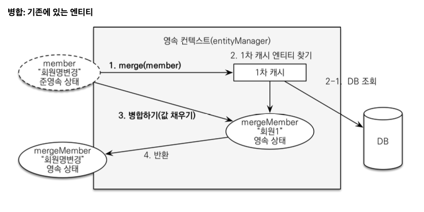

## 1. JPA 활용 1편 정리

### 1. 엔티티 설계시 주의점
   1. 엔티티에는 가급적 Setter를 사용하지 말자
      1. Setter가 모두 열려있으면 변경 포인트가 많아서 유지보수가 어려움
   2. 모든 연관관계는 지연로딩으로 설정하자
      1. 즉시로딩은 예측이 어렵고, 어떤 SQL이 실행될지 추적하기 어려움. JPQL에서는 N+1 문제가 자주 발생함
      2. 연관된 엔티티를 함께 DB에서 조회해야 하면 fetch join 또는 엔티티 그래프 기능을 사용하자
      3. XToOne 관계는 기본이 즉시로딩이므로 직접 지연로딩으로 설정해주자
   3. 컬렉션은 필드에서 초기화하자
      1. 컬렉션은 필드에서 바로 초기화하는 것이 안전하다. 
      2. null 문제에서 안전하다.
      3. 하이버네이트는 엔티티를 영속화 할 때, 컬렉션을 감싸서 하이버네이트가 제공하는 내장 컬렉션으로 변경한다. 만약 getOrders() 처럼 임의의 메서드에서 컬렉션을 잘못 생성하면 하이버네이트 내부 메커니즘에 문제가 발생할 수 있다. 따라서 필드레벨에서 생성하는 것이 안전하고 코드도 간결하다.
      ~~~ java
      Member member = new Member();
      System.out.println(member.getOrders().getClass());
      em.persist(member); // 영속화
      System.out.println(member.getOrders().getClass());
      
      //출력 결과
      class java.util.ArrayList
      class org.hibernate.collection.internal.PersistentBag
      ~~~
   4. 테이블, 컬럼명 생성 전략
      - 스프링 부트에서 하이버네이트 기본 매핑 전략을 변경해서 실제 테이블 필드명은 다름
        - https://docs.spring.io/spring-boot/docs/2.1.3.RELEASE/reference/htmlsingle/#howto-configure-hibernate-naming-strategy
        -  http://docs.jboss.org/hibernate/orm/5.4/userguide/html_single/Hibernate_User_Guide.html#naming
      - 하이버네이트 기존 구현 : 엔티티의 필드명을 그대로 테이블의 컬럼명으로 사용 (`SpringPhysicalNamingStrategy`)
      - 스프링 부트 신규 설정 (엔티티(필드) -> 테이블(컬럼))
        - 카멜 케이스 -> (_)언더스코어 ex) memberPoint -> member_point
        - . -> 언더스코어
        - 대문자 -> 소문자
      - **적용 2 단계**
        1. 논리명 생성: 명시적으로 컬럼, 테이블명을 직접 적지 않으면 ImplicitNamingStrategy 사용
           `spring.jpa.hibernate.naming.implicit-strategy` : 테이블이나, 컬럼명을 명시하지 않을 때 논리명 적용
        2. 물리명 적용: `spring.jpa.hibernate.naming.physical-strategy` : 모든 논리명에 적용됨, 실제 테이블에 적용
           (username usernm 등으로 회사 룰로 바꿀 수 있음)
        3. **스프링 부트 기본 설정**
           `spring.jpa.hibernate.naming.implicit-strategy:
           org.springframework.boot.orm.jpa.hibernate.SpringImplicitNamingStrategy`
           `spring.jpa.hibernate.naming.physical-strategy:
           org.springframework.boot.orm.jpa.hibernate.SpringPhysicalNamingStrategy` 

### 2. 연관관계 편의 메서드 위치
 - 연관관계 편의 메서드는 어디에 위치해도 상관없다. 연관관계 편의 메서드가 어디에 있든 결국 연관관계의 주인 쪽에 값이 설정되기 때문이다.

### 3. 스프링 부트의 테스트
 - 스프링 부트에서 테스트 모드에는 application.yml 등과 같이 설정을 안해줘도 자동으로 메모리 모드로 사용해준다. 
 - 스프링 부트 테스트에서는 ddl-auto: create-drop이 기본이다. 이것은 테스트를 다 돌리고 drop을 날려주는 것

### 4. CASCADE의 사용 범위는?
 - 라이프 사이클에서 동일하게 관련. 1개에 대해서만 참조를 할 떄 사용 가능 ex. 주문과 주문 상품
 - 만약 주문 상품을 다른 곳에서도 사용한다면 CASCADE를 사용하지 않는게 좋음

### 5. Entity는 순수하게 유지하자
 - 요구사항이 정말 단순할 때는 폼 객체(`MemberForm`) 없이 엔티티(`Member`)를 직접 등록과 수정 화면에서 사용해도 된다. 
 - 하지만 화면 요구사항이 복잡해지기 시작하면, 엔티티에 화면을 처리하기 위한 기능이 점점 증가한다. 
 - 결과적으로 엔티티는 점점 화면에 종속적으로 변하고, 이렇게 화면 기능 때문에 지저분해진 엔티티는 결국 유지보수하기 어려워진다.
 - 실무에서 **엔티티는 핵심 비즈니스 로직만 가지고 있고, 화면을 위한 로직은 없어야 한다**. 
 - 화면이나 API에 맞는 폼 객체나 DTO를 사용하자. 그래서 화면이나 API 요구사항을 이것들로 처리하고, 엔티티는 최대한 순수하게 유지하자

### 6. 변경 감지와 병합(merge)
- 준영속 엔티티란?
  - 영속성 컨텍스트가 더는 관리하지 않는 엔티티를 말한다.
  - DB를 갖다온 데이터(id 값이 있음)
  - 상품 수정으로 살펴보면 여기서는 `itemService.saveItem(book)` 에서 수정을 시도하는 `Book` 객체다. 
  `Book` 객체는 이미 DB에 한번 저장되어서 식별자가 존재한다. 
  이렇게 임의로 만들어낸 엔티티도 기존 식별자를 가지고 있으면 준영속 엔티티로 볼 수 있다.
- 준영속 엔티티를 수정하는 2가지 방법
  - 변경 감지 기능 사용
  - 병합(merge) 사용
#### 변경 감지 기능 사용
    ~~~ java
    @Transactional
    void update(Item itemParam) { // itemParam: 파리미터로 넘어온 준영속 상태의 엔티티
       Item findItem = em.find(Item.class, itemParam.getId()); // 같은 엔티티를 조회한다.(영속 상태)
        findItem.setPrice(itemParam.getPrice()); // 데이터를 수정한다.
    }
    ~~~
 - 영속성 컨텍스트에서 엔티티를 다시 조회한 후에 데이터를 수정하는 방법
 - 트랜잭션 안에서 엔티티를 다시 조회, 변경할 값 선택 -> 트랜잭션 커밋 시점에 변경 감지(Dirty Checking)이 동작해서 데이터베이스에서 UPDATE SQL 실행
#### 병합 사용
  - 병합은 준영속 상태의 엔티티를 영속 상태로 변경할 때 사용하는 기능이다.
  ~~~ java
    @Transactional
    void update(Item itemParam) { //itemParam: 파리미터로 넘어온 준영속 상태의 엔티티
        Item mergeItem = em.merge(itemParam);
    }
  ~~~
  
  - 병합 동작 방식
    - merge()를 실행
    - 파라미터로 넘어온 준영속 엔티티의 식별자 값으로 1차 캐시에서 엔티티를 조회
    - 만약 1차 캐시에 엔티티가 없으면 데이터베이스에서 엔티티를 조회하고, 1차 캐시에 저장
    - 조회한 영속 엔티티(mergeMember)에 member 엔티티의 값을 채워 넣는다. (member 엔티티의 모든 값을 mergeMember에 밀어 넣는다. 이때 mergeMember의 '회원1'이라는 이름이 '회원명변경'으로 바뀐다.)
    - 영속 상태인 mergeMember를 반환한다
  - 병합시 동작 방식을 간단하게 정리하기!!
    - 준영속 엔티티의 식별자 값으로 영속 엔티티를 조회
    - 영속 엔티티의 값을 준영속 엔티티의 값으로 모두 교체(병합)
    - 트랜잭션 커밋 시점에 변경 감지 기능이 동작해서 데이터베이스에 UPDATE SQL 실행
- !!!주의!!! 변경 감지 기능을 사용하면 원하는 속성만 선택해서 변경할 수 있지만, 병합을 사용하면 모든 속성이 변경된다. 병합시 값이 없으면 null로 업데이트할 위험도 있다.

-----
## 2. JPA 활용 2편

### 1. API를 만들어서 사용할 때는 엔티티를 넘기거나 받지말자
- 문제점 
  - 엔티티에 프레젠테이션 계층을 위한 로직이 추가된다. 
  - 엔티티에 API 검증을 위한 로직이 들어간다. (@NotEmpty 등등)
  - 실무에서는 회원 엔티티를 위한 API가 다양하게 만들어지는데, 한 엔티티에 각각의 API를 위한 모든 요청 요구사항을 담기는 어렵다. 
  - 엔티티가 변경되면 API 스펙이 변한다. 
- 결론 
  - API 요청 스펙에 맞추어 별도의 DTO를 파라미터로 받는다.

### 2. API 개발 고급
 #### 1. 엔티티를 직접 노출(V1)
   - 엔티티를 직접 노출할 때는 양방향 연관관계가 걸린 곳은 꼭 한 곳에 @JsonIgnore 처리를 해야 한다. 해주지 않으면 양쪽 서로를 호출하면서 무한 루프 발생
   - 해결 방법은 Hibernate5Module을 사용하면 되는데 이 방법보다는 DTO로 변환해서 반환하는 것이 더 좋은 방법이다.
   - LAZY를 피하기 위해 EAGER로 설정하면 안된다. 즉시 로딩 때문에 연관관계가 필요 없는 경우에도 데이터를 항상 조회해서 성능 문제가 발생할 수 있다.
 #### 2. 엔티티를 DTO로 변환(V2)
   - 쿼리가 총 1 + N + N번 실행 된다(v1과 쿼리수 결과는 같음)
   - order 조회 1번(order 조회 결과 수가 N이 된다)
   - order -> member 지연 로딩 조회 N번
   - order -> delivery 지연 로딩 조회 N번
   - v2의 결과는 order의 개수가 2개이므로 1 + 2(회원) + 2(배송지) 실행
   - 만약 1명의 유저가 2개의 주문을 했다면 영속성 컨텍스트에 있는 걸로 조회하기 때문에 쿼리를 날리지 않음