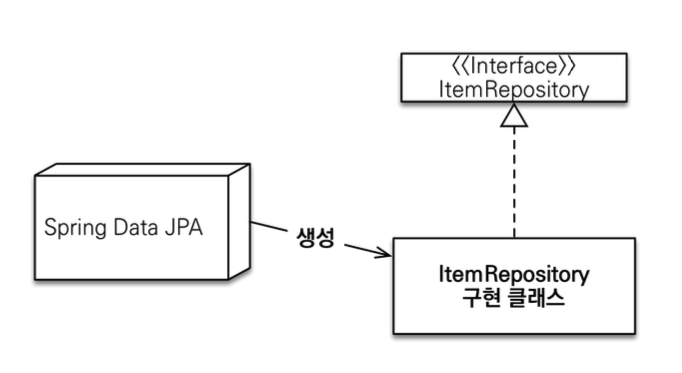
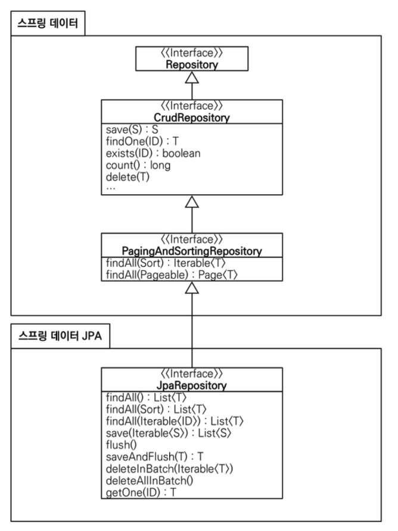

# 스프링 데이터 JPA 강의 정리

## 1. JPA 공통 인터페이스
### 1. 공통 인터페이스 설정
- **JavaConfig 설정 - 스프링 부트 사용시 생략 가능**
  - 스프링 부트 사용시`@SpringBootApplication` 위치를 지정(해당 패키지와 하위 패키지 인식)
  - 만약, 위치가 달라지면 `@EnableJpaRepositories` 필요
```java
@Configuration
@EnableJpaRepositories(basePackages = "jpabook.jpashop.repository")
public class AppConfig {}
```

- **스프링 데이터 JPA가 구현 클래스 대신 생성**


  - `org.springframework.data.repository.Repository`를 구현한 클래스는 스캔 대상
    - 스프링 데이터 JPA가 알아서 구현체를 만들고 주입을 해준다.
    - MemberRepository 인터페이스가 동작한 이유이다.
    - 실제 출력해보면 memberRepository.getClass() -> class com.sun.proxy.$ProxyXXX
      - 자바의 기술을 가지고 가짜 클래스를 만들어서 주입
  - `@Repository` 어노테이션 생략 가능하다.
    - 컴포넌트 스캔을 스프링 데이터 JPA가 자동으로 처리
    - JPA 예외를 스프링 예외로 변환하는 과정도 자동으로 처리

### 2. 공통 인터페이스 분석
- JpaRepository 인터페이스 : 공통 CRUD 제공
- 제네릭은 <엔티티 타입, 식별자 타입> 설정
- `JpaRepository` 공통 기능 인터페이스
~~~ java
public interface JpaRepository<T, ID extends Serializable> extends PagingAndSortingRepository<T, ID> {
  ...
}
~~~

- `JpaRepository` 를 사용하는 인터페이스
~~~ java
public interface MemberRepository extends JpaRepository<Member, Long> {}
~~~

- **공통 인터페이스 구성**



- **제네릭 타입**
  - `T` : 엔티티
  - `ID` : 엔티티의 식별자 타입
  - `S` : 엔티티와 그 자식 타입
- **주요 메서드**
  - `save(S)` : 새로운 엔티티는 저장하고 이미 있는 엔티티는 병합한다.
  - `delete(T)` : 엔티티 하나를 삭제한다. 내부에서 `EntityManager.remove()` 호출
  - `findById(ID)` : 엔티티 하나를 조회한다. 내부에서 `EntityManager.find()` 호출
  - `getOne(ID)` : 엔티티를 프록시로 조회한다. 내부에서 `EntityManager.getReference()` 호출
  - `findAll(…)` : 모든 엔티티를 조회한다. 정렬(`Sort`)이나 페이징(`Pageable`) 조건을 파라미터로 제공할 수 있다.
  
- 참고: `JpaRepository` 는 대부분의 공통 메서드를 제공한다.

## 3. 쿼리 메서드 기능
* **쿼리 메서드 기능 3가지**
  * 메서드 이름으로 쿼리 생성
  * 메서드 이름으로 JPA NamedQuery 호출
  * `@Query` 어노테이션을 사용해서 리파지토리 인터페이스에 쿼리 직접 정의

### 1. 메서드 이름으로 쿼리 생성
~~~ java
public interface MemberRepository extends JpaRepository<Member, Long> {
    List<Member> findByUsernameAndAgeGreaterThan(String username, int age);
}
~~~
* 스프링 데이터 JPA는 메서드 이름을 분석해서 JPQL을 생성하고 실행한다.
  * 엔티티의 필드명이 변경되면 인터페이스에 정의한 메서드 이름도 꼭 함께 변경해야한다.
  * 변경하지 않으면 애플리케이션 시작하는 시점에 No Property라는 오류가 발생한다.
* 쿼리 메서드 필터 조건은 스프링 데이터 JPA 공식 문서를 참고하자!
  * https://docs.spring.io/spring-data/jpa/reference/jpa/query-methods.html

* **스프링 데이터 JPA가 제공하는 쿼리 메서드 기능**
  * 조회: find…By ,read…By ,query…By get…By
    * 예:) findHelloBy 처럼 ...에 식별하기 위한 내용(설명)이 들어가도 된다. 
  * COUNT: count…By 반환타입 `long`
  * EXISTS: exists…By 반환타입 `boolean`
  * 삭제: delete…By, remove…By 반환타입 `long`
  * DISTINCT: findDistinct, findMemberDistinctBy
  * LIMIT: findFirst3, findFirst, findTop, findTop3

### 2. JPA NamedQuery
* 쿼리에 이름을 부여하고 호출하는 기능이다.
* 장점 : 애플리케이션 로딩 시점에 문법 오류가 있으면 오류를 보여준다.
* 사용 방법
  * 엔티티에 @NamedQuery 어노테이션으로 Named 쿼리 정의
    ``` java
    @Entity
    @NamedQuery(
        name="Member.findByUsername",
        query="select m from Member m where m.username = :username")
    public class Member {
      ...
    }
    ```
    
  * **JPA를 직접 사용해서 Named 쿼리 호출**
    ```java
    public class MemberRepository {
        public List<Member> findByUsername(String username) {
            List<Member> resultList =
            em.createNamedQuery("Member.findByUsername", Member.class)
                .setParameter("username", username)
                .getResultList();
        }
    }
    ```

* **스프링 데이터 JPA로 Named 쿼리 호출**
    * @Query를 생략하고 메서드 이름만으로 Named 쿼리를 호출할 수 있다.
    * 스프링 데이터 JPA는 선언한 도메인 클래스 + . + 메서드 이름으로 Named 쿼리를 찾아서 실행한다.
    * 만약 실행할 Named 쿼리가 없으면 메서드 이름으로 쿼리 생성 전략을 사용한다.
    * 필요하면 전략을 변경할 수 있지만 권장하는 방법은 아니다.
  ```java
    public interface MemberRepository
        extends JpaRepository<Member, Long> { //** 여기 선언한 Member 도메인 클래스
  
        @Query(name = "Member.findByUsername") // 아래와 같이 해당 어노테이션이 없어도됨
        List<Member> findByUsername(@Param("username") String username);
  
        List<Member> findByUsername(@Param("username") String username);
    }
  ```

### 3. @Query, 리포지토리 메소드에 쿼리 정의하기
* `org.springframework.data.jpa.repository.Query` 어노테이션을 사용
* 실행할 메서드에 정적 쿼리를 직접 작성하므로 이름 없는 Named 쿼리라 할 수 있음
* JPA Named 쿼리처럼 애플리케이션 실행 시점에 문법 오류를 반결할 수 있음
```java
public interface MemberRepository extends JpaRepository<Member, Long> {
    @Query("select m from Member m where m.username= :username and m.age = :age")
    List<Member> findUser(@Param("username") String username, @Param("age") int age);
}
```

### 4. @Query를 사용하여 값, DTO 조회하기
* 단순히 값 하나를 조회하는 방법
```markdown
@Query("select m.username from Member m")
List<String> findUsernameList();
```

* DTO로 직접 조회하는 방법
  * new 명령어 사용 필요
```markdown
@Query("select new study.data_jpa.dto.MemberDto(m.id, m.username, t.name) from Member m join m.team t")
List<MemberDto> findMemberDto();
```

### 5. 파라미터 바인딩
* 파라미터 바인딩에는 2가지가 있다.
  * 위치 기반
  * 이름 기반
* 코드 가독성과 유지보수를 위해 이름 기반 파라미터 바인딩을 사용하자
```markdown
select m from Member m where m.username = ?0 //위치 기반
select m from Member m where m.username = :name //이름 기반
```
* 파라미터 바인딩
```java
import org.springframework.data.repository.query.Param
public interface MemberRepository extends JpaRepository<Member, Long> {
    @Query("select m from Member m where m.username = :name")
    Member findMembers(@Param("name") String username);
}
```

* 컬렉션 파라미터 바인딩
  * Collection 타입으로 in절 지원
```java
@Query("select m from Member m where m.username in :names")
List<Member> findByNames(@Param("names") List<String> names);
```

### 6. 반환 타입
스프링 데이터 JPA는 유연한 반환 타입을 지원한다.
```markdown
List<Member> findByUsername(String name); //컬렉션
Member findByUsername(String name); //단건
Optional<Member> findByUsername(String name); //단건 Optional
```
* 조회 결과가 많거나 없으면?
  * 컬렉션은 결과가 없다면 빈 컬렉션을 반환한다
  * 단건 조회시
    * 결과가 없으면 null을 반환
    * 결과가 2건 이상이면 `javax.persistence.NonUniqueResultException`이 발생
* 참고
  * 단건으로 지정한 메서드를 호출하면 스프링 데이터 JPA는 내부에서 JPQL의 `Query.getSingleResult()` 메서드를 호출한다.
  * 이 메서드를 호출했을 때 결과가 없으면 `javax.persistence.NoResultException` 예외가 발생한다.
  * 스프링 데이터 JPA는 단건을 조회할 때 이 예외가 발생하면 예외를 무시하고 대신에 null을 반환한다.
  * Optional을 사용하면 Optional.empty가 넘어온다.

### 7. 순수 JPA 페이징과 정렬
* 조건
  * 나이가 10살
  * 이름으로 내림차순
  * 첫 번째 페이지, 페이지당 보여줄 데이터는 3건
* JPA 페이징 리포지토리 코드
  * setFirstResult로 시작 페이지를 지정
  * setMaxResults로 페이지당 보여줄 데이터 개수를 지정
```java
public List<Member> findByPage(int age, int offset, int limit) {
    return em.createQuery("select m from Member m where m.age = :age order by m.username desc", Member.class)
        .setParameter("age", age)
        .setFirstResult(offset)
        .setMaxResults(limit)
        .getResultList();
    }

public long totalCount(int age) {
    return em.createQuery("select count(m) from Member m where m.age = :age", Long.class)
        .setParameter("age", age)
        .getSingleResult();
    }
```
